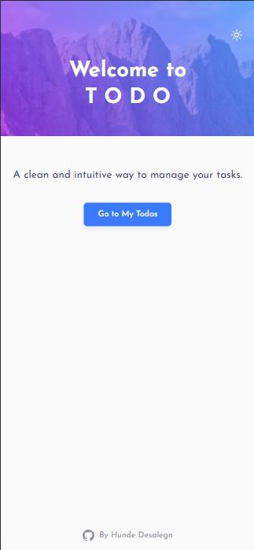
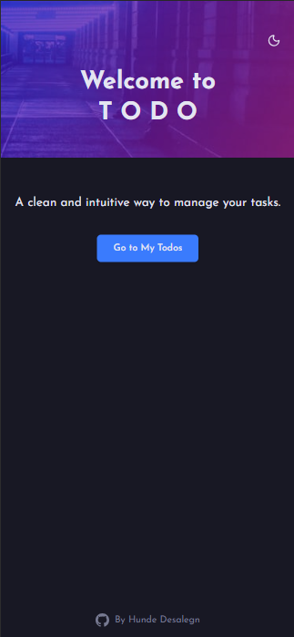
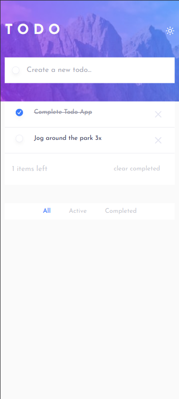
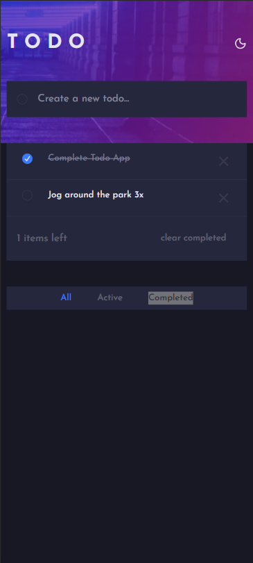
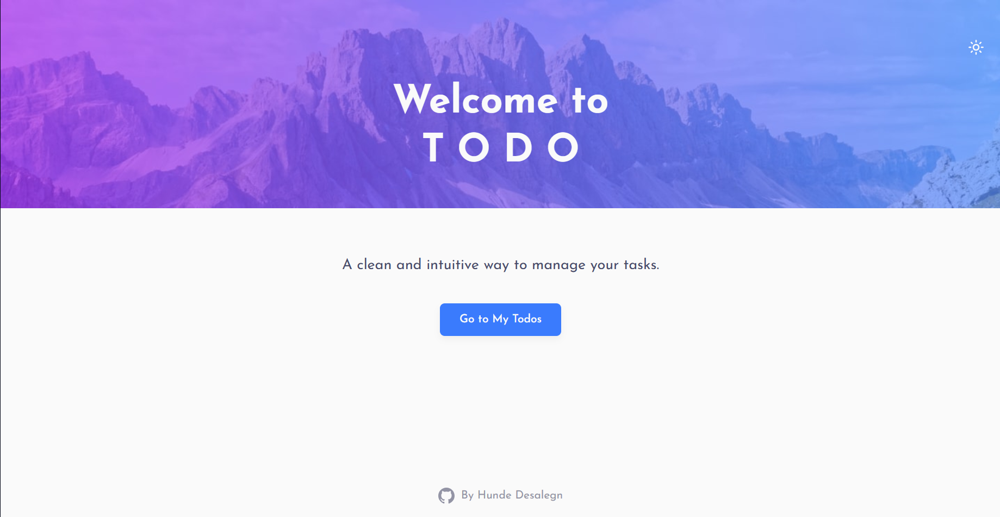
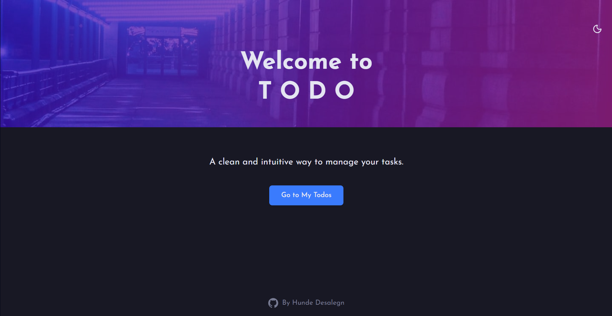
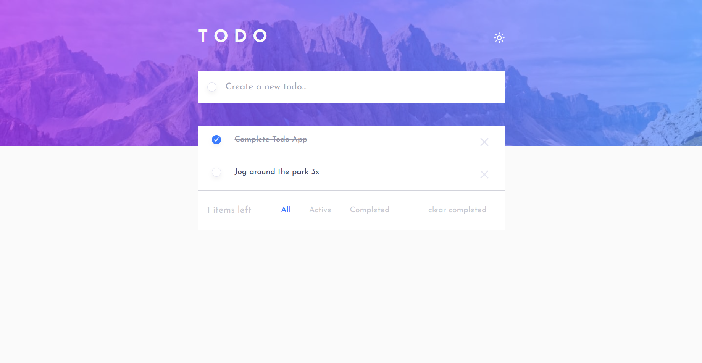
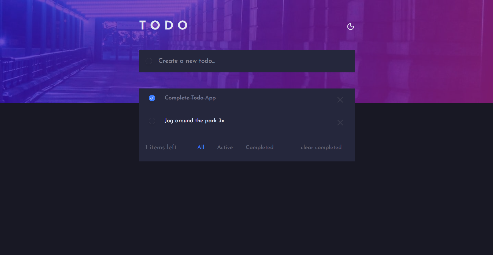

# 📝 Todo App

A simple yet elegant Todo application built with **React**, **TailwindCSS**, and **TypeScript**.
Supports **dark mode**, **responsive design**, and filtering tasks.

👨‍💻 Built by [Hunde Desalegn](https://github.com/Hunde-D)

---

## 🚀 Features

- ✅ Add / Delete / Toggle Todos
- 🌙 Light & Dark Mode
- 📱 Fully Responsive (Mobile & Desktop)
- 🔍 Filter: _All, Active, Completed_
- 🧹 Clear Completed

---

## 📸 Screenshots

### Mobile

#### Welcome Page

<div align="center">
  
  
</div>

#### Todo Page

<div align="center">
  
  
</div>
### Desktop

#### Welcome Page

<div align="center">
  
  
</div>

#### Todo Page

<div align="center">
  
  
</div>

---

## 🛠️ Tech Stack

- [React](https://react.dev/)
- [React Router v7](https://reactrouter.com/)
- [TailwindCSS](https://tailwindcss.com/)
- [TypeScript](https://www.typescriptlang.org/)

---

## ⚙️ Installation

Clone the repo and install dependencies:

```bash
git clone https://github.com/Hunde-D/todo-list.git
cd todo-list
pnpm install
```

---

## 👨‍💻 About Me

Hi, I'm **Hunde Desalegn** 👋 — a passionate fullstack developer building clean, modern web apps.

- 💻 [GitHub](https://github.com/Hunde-D)
- 📧 hunde.ddh@gmail.com
